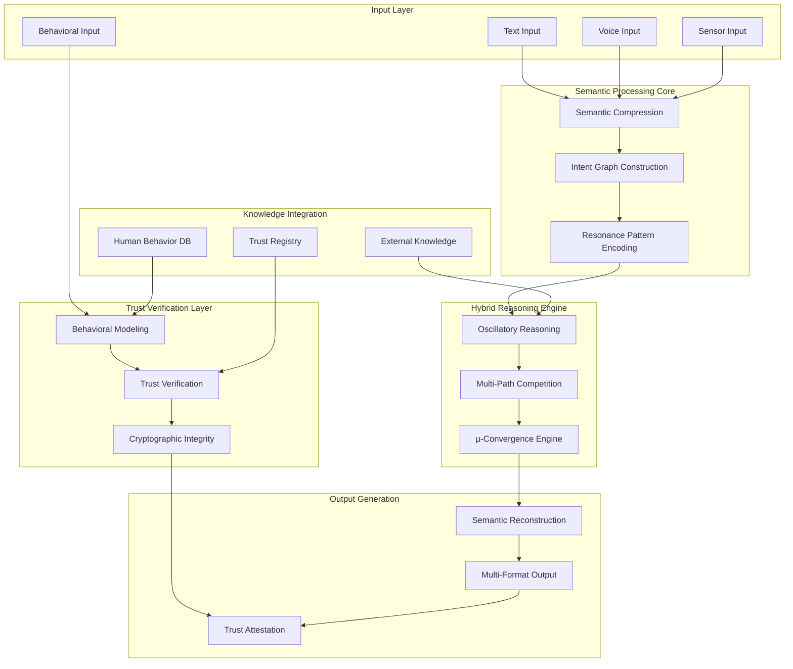

# Design Document: Hybrid Semantic Reasoning AI with Trust Verification

## Overview

The Hybrid Semantic Reasoning AI (HSRAI) combines the structured pipeline approach of the Intentional Semantic Reasoning Engine (ISRE) with the oscillatory dynamics of the Unified μ-Resonance Cognitive Mesh (URCM) to create a novel reasoning system that integrates human digital behavior patterns and provides trust verification infrastructure.

The system operates on three core principles:
1. **Semantic-First Processing**: Pre-linguistic semantic extraction before any language-based reasoning
2. **Oscillatory Stability**: Frequency-based resonance patterns that provide natural termination and error correction
3. **Trust-Verified Reasoning**: Integration of human behavioral patterns with cryptographic verification of reasoning processes

## Architecture

### High-Level System Architecture



### Core Processing Pipeline

The system follows a 6-stage hybrid pipeline that combines structured reasoning with oscillatory dynamics:

1. **Semantic Compression**: Multi-modal input → language-agnostic semantic primitives
2. **Intent Graph Construction**: Semantic primitives → structured intent representations with conflict detection
3. **Resonance Encoding**: Intent graphs → frequency-based resonance patterns using phoneme-derived mappings
4. **Oscillatory Reasoning**: Resonance patterns → competitive multi-path reasoning with μ-convergence
5. **Trust Verification**: Reasoning paths → behavioral validation and cryptographic attestation
6. **Semantic Reconstruction**: Verified reasoning → multi-format output with trust certificates

## Components and Interfaces

### Semantic Compression Engine
**Purpose**: Convert multi-modal inputs into language-agnostic semantic primitives

**Key Features**:
- Phoneme-based frequency mapping (Sanskrit-derived phoneme set)
- Cross-linguistic semantic alignment
- Behavioral pattern integration
- Deterministic compression ensuring identical inputs produce identical outputs

**Interface**:
```
Input: Multi-modal data (text, voice, behavioral signals, sensors)
Output: SemanticPrimitive[] with behavioral context
Properties: Language-agnostic, deterministic, behaviorally-aware
```

### Intent Graph Constructor
**Purpose**: Transform semantic primitives into structured, inspectable intent representations with behavioral context

**Key Features**:
- Typed intent nodes (goal, context, query, constraint, emotion, behavioral-pattern)
- Weighted relationship edges (causal, temporal, logical, priority, trust-based)
- Explicit conflict detection and representation
- Behavioral intent classification

**Interface**:
```
Input: SemanticPrimitive[] with behavioral metadata
Output: IntentGraph with trust annotations
Properties: Inspectable, modifiable, conflict-aware, trust-annotated
```

### Hybrid Reasoning Engine
**Purpose**: Perform intentional reasoning using combined structured and oscillatory approaches

**Core Components**:
- **Multi-Path Generator**: Creates competing reasoning strategies
- **Oscillatory Gating**: Applies frequency-based modulation using global rhythm g(t) = cos(2πωt)
- **μ-Convergence Calculator**: Measures reasoning stability as μ = ρ/χ (semantic density/transformation cost)
- **Competitive Selection**: Selects optimal reasoning path based on intent satisfaction and behavioral alignment

**Key Algorithm**: Reasoning paths compete through oscillatory dynamics until μ-convergence (Δμ → 0) provides natural termination

### Trust Verification Layer
**Purpose**: Integrate human behavioral patterns and provide cryptographic verification of reasoning processes

**Core Components**:
- **Behavioral Pattern Matcher**: Compares reasoning patterns against known human behavioral models
- **Trust Score Calculator**: Generates trust metrics based on behavioral alignment and reasoning consistency
- **Cryptographic Attestation**: Creates verifiable certificates for reasoning processes
- **Anomaly Detection**: Identifies reasoning patterns that deviate from expected human-like behavior

### Knowledge Integration Hub
**Purpose**: Provide external knowledge access while maintaining trust verification

**Key Features**:
- Structured knowledge databases with trust ratings
- Human behavioral pattern libraries
- Physics and domain rule engines
- Trust registry for knowledge source verification
- Explicit knowledge gap detection with trust implications

### Output Reconstruction System
**Purpose**: Convert verified reasoning into multi-format outputs with trust attestation

**Key Features**:
- Multi-format generation (natural language, code, actions, structured data)
- Trust certificate embedding
- Behavioral consistency validation
- Semantic equivalence across output formats

## Data Models

### Core Data Structures

**SemanticPrimitive**:
```
{
  id: string,
  concept: string,
  semantic_weight: float,
  behavioral_context: BehavioralMetadata,
  trust_score: float
}
```

**IntentNode**:
```
{
  id: string,
  type: IntentType,
  semantic_payload: SemanticPrimitive[],
  behavioral_alignment: float,
  trust_annotations: TrustMetadata[]
}
```

**ResonanceState**:
```
{
  frequency_vector: float[],
  mu_value: float,
  oscillation_phase: float,
  behavioral_signature: BehavioralPattern,
  trust_level: TrustLevel
}
```

**TrustCertificate**:
```
{
  reasoning_hash: string,
  behavioral_alignment_score: float,
  cryptographic_signature: string,
  timestamp: datetime,
  verification_chain: VerificationStep[]
}
```

## Trust Verification Infrastructure

### Behavioral Integration
The system integrates human digital behavior patterns at multiple levels:

- **Input Analysis**: Behavioral signals inform semantic compression
- **Intent Recognition**: Behavioral patterns help classify and prioritize intents
- **Reasoning Validation**: Reasoning paths are validated against expected human behavioral models
- **Output Verification**: Generated outputs are checked for behavioral consistency

### Trust Metrics
Trust is calculated through multiple dimensions:

- **Behavioral Alignment**: How well reasoning matches human behavioral patterns
- **Consistency Score**: Internal logical consistency of reasoning process
- **Source Verification**: Trust ratings of knowledge sources used
- **Cryptographic Integrity**: Verification of reasoning process integrity

### Verification Chain
Each reasoning process generates a verifiable chain:

1. Input hash with behavioral metadata
2. Semantic compression verification
3. Intent graph construction audit
4. Reasoning path selection justification
5. Output generation verification
6. Final trust certificate with cryptographic signature

## Error Handling

### Hybrid Error Recovery
The system combines structured error handling with oscillatory self-correction:

**Semantic Compression Errors**:
- Fallback to basic extraction with behavioral context preservation
- Cross-modal validation using behavioral signals

**Reasoning Convergence Failures**:
- Oscillatory phase reset with behavioral pattern guidance
- Alternative path generation using trust-weighted selection

**Trust Verification Failures**:
- Behavioral anomaly flagging with human review triggers
- Cryptographic verification failure handling with audit trails

**Behavioral Alignment Issues**:
- Pattern mismatch detection with confidence scoring
- Human behavioral model updates based on verified patterns

## Testing Strategy

The HSRAI requires comprehensive testing across multiple dimensions: semantic correctness, oscillatory stability, behavioral alignment, and trust verification.

### Property-Based Testing Framework
- **Framework**: Hypothesis (Python) for property-based testing
- **Configuration**: Minimum 100 iterations per property test
- **Test Tagging**: **Feature: hybrid-semantic-reasoning-ai, Property {number}: {property_text}**

### Testing Dimensions

**Semantic Processing Tests**:
- Cross-linguistic semantic consistency
- Multi-modal input integration
- Deterministic compression validation

**Oscillatory Dynamics Tests**:
- μ-convergence behavior across input types
- Oscillatory stability under various conditions
- Natural termination verification

**Behavioral Integration Tests**:
- Human behavioral pattern matching accuracy
- Behavioral anomaly detection sensitivity
- Trust score calculation consistency

**Trust Verification Tests**:
- Cryptographic integrity validation
- Verification chain completeness
- Trust certificate authenticity

### Dual Testing Approach
- **Unit Tests**: Specific examples, edge cases, integration points
- **Property Tests**: Universal properties across infinite input spaces
- **Behavioral Tests**: Human behavioral pattern validation
- **Trust Tests**: Cryptographic and verification system validation

The testing strategy ensures the system maintains semantic correctness, oscillatory stability, behavioral alignment, and trust verification across all possible inputs and reasoning scenarios.